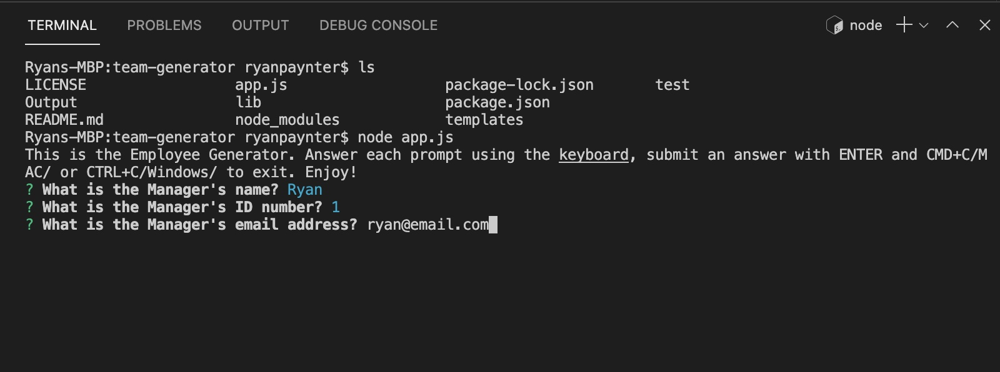
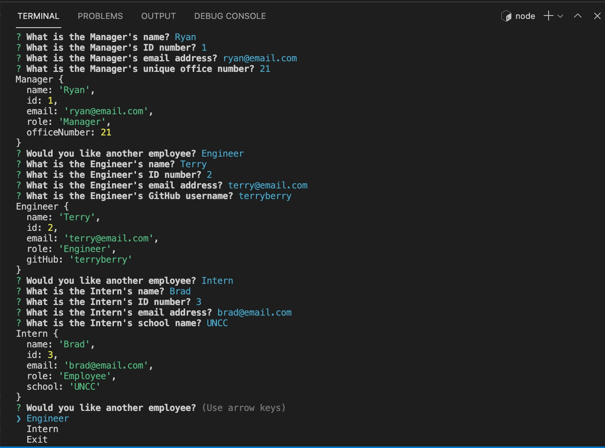
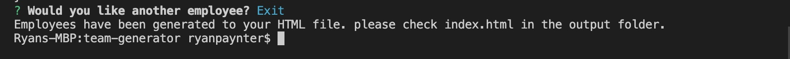
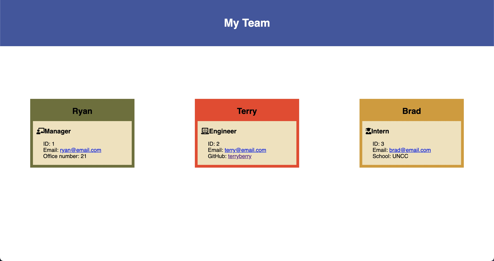
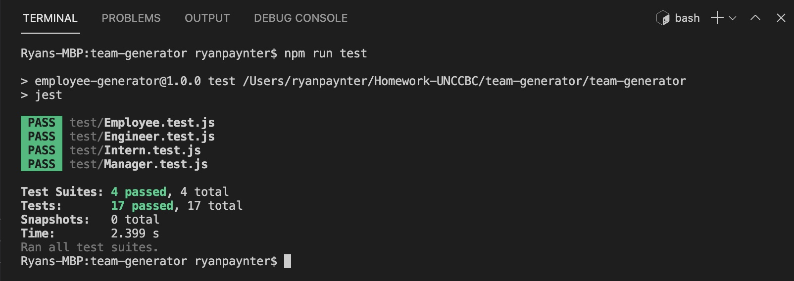

# team-generator

 ## Table Of Contents

- [Description](#description)
- [Installation](#installation)
- [Usage](#usage)
- [License](#license)
- [Contributing](#contributing)
- [Tests](#tests)
- [Questions](#questions)

## Description
This program is designed to track user input by using node js/JEST/Inquirer and create a team full of engineers, interns, and a manager. Simply download, open, type in your commands in the terminal, and open the output html file in your browser to get going!

## Installation
While on my github page please fork the document and clone the following repo.
Install NODE.js on your machine
Open the terminal and type in "npm i"
Install Inquirer and jest "npm i inquirer" and "npm i jest".

## Usage
1)

2)

3)

4)

## Contribution
Open to contribution just email me at ryanpaynt@outlook.com

## Tests
Simply run "npm run test" in terminal and you will see this

## Questions
Please use the email above if you have any questions!

## License
Copyright © <2021> <copyright Ryan Paynter>

Permission is hereby granted, free of charge, to any person obtaining a copy of this software and associated documentation files (the “Software”), to deal in the Software without restriction, including without limitation the rights to use, copy, modify, merge, publish, distribute, sublicense, and/or sell copies of the Software, and to permit persons to whom the Software is furnished to do so, subject to the following conditions:

The above copyright notice and this permission notice shall be included in all copies or substantial portions of the Software.

THE SOFTWARE IS PROVIDED “AS IS”, WITHOUT WARRANTY OF ANY KIND, EXPRESS OR IMPLIED, INCLUDING BUT NOT LIMITED TO THE WARRANTIES OF MERCHANTABILITY, FITNESS FOR A PARTICULAR PURPOSE AND NONINFRINGEMENT. IN NO EVENT SHALL THE AUTHORS OR COPYRIGHT HOLDERS BE LIABLE FOR ANY CLAIM, DAMAGES OR OTHER LIABILITY, WHETHER IN AN ACTION OF CONTRACT, TORT OR OTHERWISE, ARISING FROM, OUT OF OR IN CONNECTION WITH THE SOFTWARE OR THE USE OR OTHER DEALINGS IN THE SOFTWARE.
